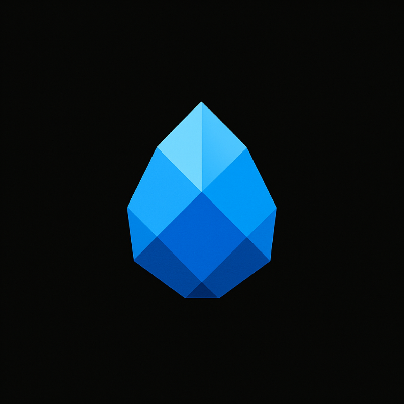

  

<h1 align="center">Sapphire</h1>

  ⚡ A high-performance, Rust-powered Minecraft Bedrock server 
  🔧 Built from scratch for speed, stability, and scalability 

---

## 🚀 About

**Sapphire** is a next-gen Minecraft Bedrock server written in **Rust** 🦀.  
Designed for performance and reliability, it aims to provide:

- ⚡ **High throughput**: Fast networking built with async Rust
- 🧱 **From the ground up**: No legacy code, 100% Rust-native
- 🧪 **Scalable architecture**: ECS + async = massive potential

## 📦 Features (Work in Progress)

- ✅ Custom RakNet implementation
- 🔄 Plugin system with hot-reloading
- 🔌 API for third-party extensions
- 🌐 Cross-platform voice chat integration *(planned)*

## 🧠 Why Sapphire?

- If you're tired of slow, unmaintainable server codebases and want something clean, fast, and modern — Sapphire is for you.

## 📄 License
- MIT License. Feel free to use and contribute 🤝